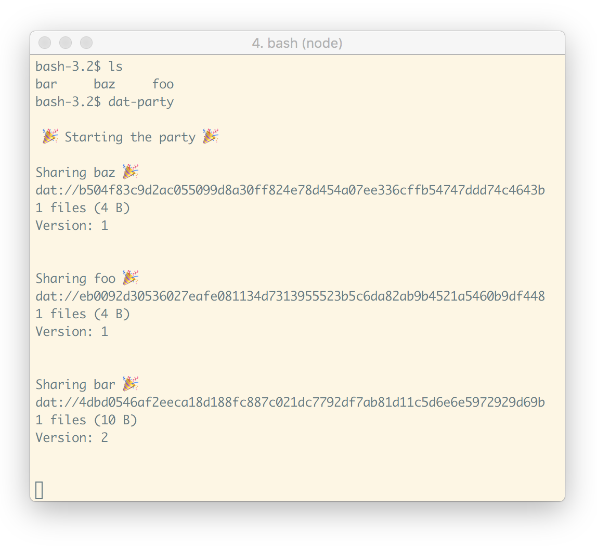

# Dat Party 🎉
A command for running `dat share` in all folders in the directory that you run the `dat-party` command in. Auto detection of new folders is supported.

```
npm install -g dat-party
cd folder-of-folder-i-want-to-share
dat-party
```



